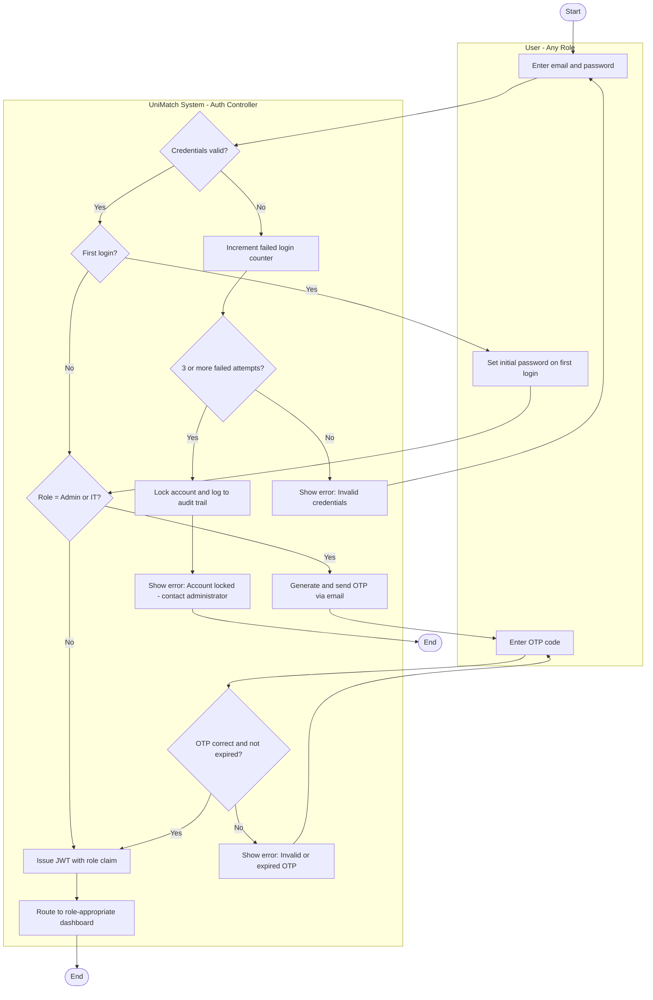
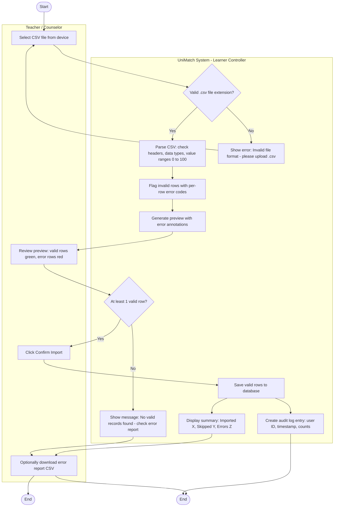
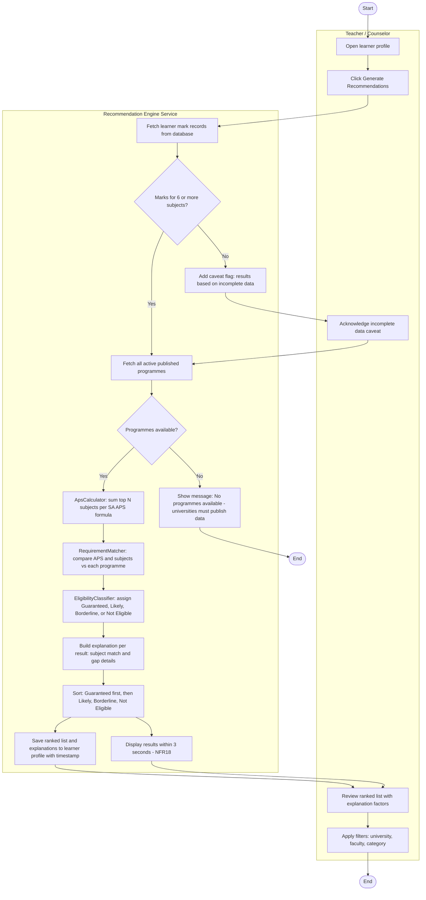
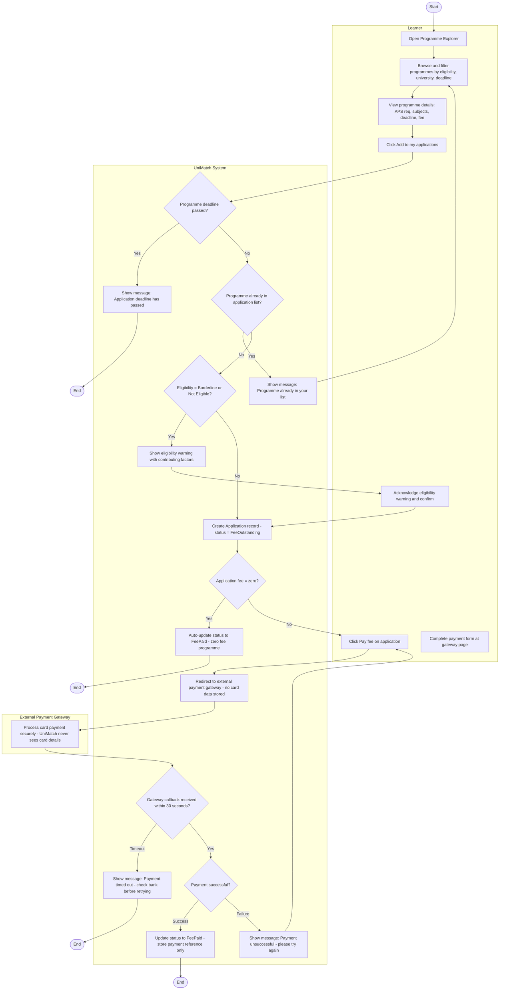
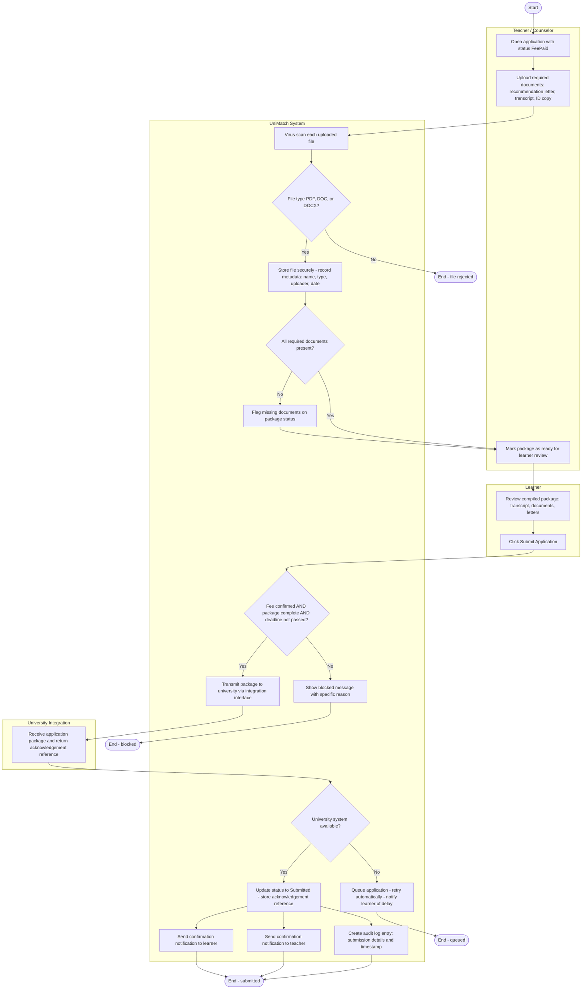
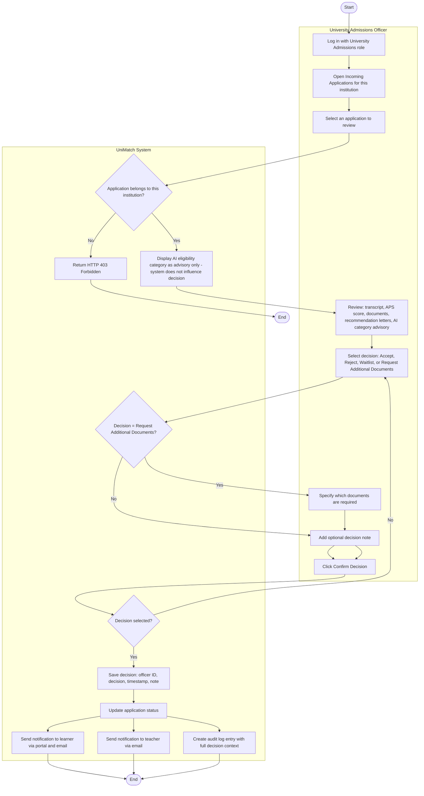
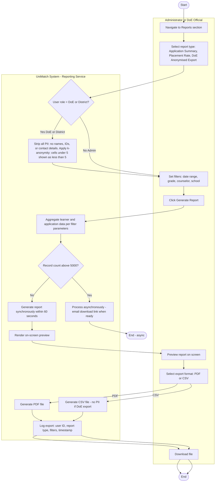
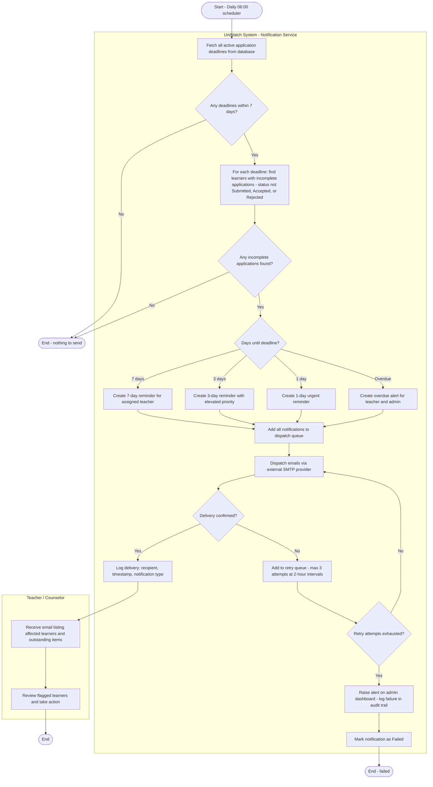

# Assignment 8: Activity Workflow Modeling — Activity Diagrams
# UniMatch – School-Based University Application & Eligibility System
 
**Author**: Christinah Mmabotse Mosima
**Date**: 2026-04-15
**Assignment**: 8 – Object State Modeling and Activity Workflow Modeling
 
---
 
## Overview
 
This document defines 8 activity diagrams for the most complex workflows in UniMatch. Each diagram uses swimlanes to show which actor is responsible for each action, includes decision points with explicit branching logic, and identifies parallel actions where the system performs concurrent operations.
 
---
## 2. Activity Diagrams
 
---
 
### AD1 — User Login and Authentication
 
**Workflow**: A user logs in. The system validates credentials, enforces MFA for Admin and IT roles, and routes to the role-appropriate dashboard.
 

 
**Swimlanes**: User (any role), UniMatch System (Auth Controller).
 
**Decisions**: Credential validity, first-login detection, role-based MFA check, OTP validation, lockout threshold.
 
**Parallel actions**: OTP email dispatch and display of the OTP entry form occur simultaneously — the user sees the form immediately while the email is being sent in the background.
 
**Stakeholder concern addressed**: Account lockout (3 failures) addresses IT Support's security compliance requirement. MFA branch (NFR14) protects privileged accounts. Role-aware routing meets NFR2 (3-click task completion from dashboard).
 
**Requirement mapping**: FR10, FR15, NFR14, UC1, UC15, US001, US002, US003.
 
---
 
### AD2 — Import Learner Marks via CSV
 
**Workflow**: A teacher uploads a CSV file of learner marks. The system validates, previews, and imports valid records while reporting per-row errors.
 

 
**Swimlanes**: Teacher / Counselor, UniMatch System (Learner Controller).
 
**Parallel actions**: After the teacher confirms, `SaveValidRows` triggers both `CreateAudit` and `GenerateSummary` concurrently — data is persisted while the summary is rendered.
 
**Decisions**: File format validation, invalid row detection, minimum valid row check.
 
**Stakeholder concern addressed**: Teachers' pain point of "time-consuming manual data entry" — bulk import replaces row-by-row entry. Per-row error report (TC004) lets teachers fix specific problems without re-uploading the entire file.
 
**Requirement mapping**: FR2, NFR20, UC4, US006, TC003, TC004.
 
---
 
### AD3 — Generate AI Eligibility Recommendations
 
**Workflow**: The full recommendation pipeline from teacher trigger through ranked results with explanation factors.
 

 
**Swimlanes**: Teacher / Counselor, Recommendation Engine Service (matching ARCHITECTURE.md §4–5 component names: ApsCalculator, RequirementMatcher, EligibilityClassifier).
 
**Parallel actions**: `SaveResults` and `DisplayResults` execute concurrently after ranking — the database write and UI render happen simultaneously so the 3-second NFR18 target is not blocked by persistence.
 
**Decisions**: Minimum subject count (6 required for reliable APS), programme availability.
 
**Stakeholder concern addressed**: Replaces teacher's manual spreadsheet APS calculations (STAKEHOLDER_ANALYSIS.md pain point). Explanation factors address AI ethics concern — no opaque scores, every result is explainable to the learner.
 
**Requirement mapping**: FR3, FR4, NFR18, UC5, US008, US009, TC005, TC006, TC-NFR05.
 
---
 
### AD4 — Learner Programme Selection and Fee Payment
 
**Workflow**: The learner browses programmes, selects one, and completes fee payment through the external gateway.
 

 
**Swimlanes**: Learner, UniMatch System, External Payment Gateway (separate swimlane — outside UniMatch boundary).
 
**Parallel actions**: Not present — payment is a sequential safety-critical flow where each step must complete before the next begins.
 
**Decisions**: Deadline check, duplicate detection, eligibility warning, zero-fee bypass, gateway timeout, payment result.
 
**Stakeholder concern addressed**: Gateway swimlane separation makes the anti-fraud design explicit: UniMatch never touches card data (TC-NFR03, US029). Learner autonomy preserved — Borderline/Not Eligible selections warn but do not block (UC7-AF2).
 
**Requirement mapping**: UC7, UC8, NFR13, US012–US015, US029, TC-NFR03.
 
---
 
### AD5 — Compile Application Package and Submit
 
**Workflow**: Teacher compiles the application package, learner reviews it, and the application is submitted to the university.
 

 
**Swimlanes**: Teacher / Counselor, Learner, UniMatch System, University Integration.
 
**Parallel actions**: After `UpdateSubmitted`, `NotifyLearner`, `NotifyTeacher`, and `CreateAudit` execute concurrently — the learner and teacher receive confirmation simultaneously, and the audit entry is written at the same time.
 
**Decisions**: File type validation, document completeness check, pre-submission triple guard (fee + documents + deadline), university system availability.
 
**Stakeholder concern addressed**: University Admissions' concern about incomplete applications — CheckAllDocs physically blocks submission until every required document is present. The QueueRetry path (UC10-AF3) prevents data loss if the university integration is temporarily unavailable.
 
**Requirement mapping**: FR5, FR6, UC9, UC10, US016–US018, TC008, TC009, TC010.
 
---
 
### AD6 — University Admissions Review and Decision
 
**Workflow**: A University Admissions Officer reviews a submitted application and records an official admission decision.
 

 
**Swimlanes**: University Admissions Officer, UniMatch System.
 
**Parallel actions**: After `UpdateStatus`, `NotifyLearner`, `NotifyTeacher`, and `CreateAudit` execute concurrently — learner and teacher receive outcomes simultaneously without sequential delay.
 
**Decisions**: Institution scope check (HTTP 403 enforces data isolation), decision type (whether additional documents are needed), decision validation.
 
**Critical design**: `ShowAIAdvisory` is a deliberate system step — the AI eligibility category is displayed for officer reference but marked advisory only. The system does not pre-filter or rank applications by this category. Decision authority belongs to the university (Assignment 5, Decision Authority Matrix §2.2).
 
**Requirement mapping**: FR5, FR15, UC11, US018, US019, TC007, TC014.
 
---
 
### AD7 — Generate and Export Analytics Report
 
**Workflow**: A School Administrator or DoE Official generates an analytics report. PII anonymisation is enforced structurally for government exports.
 

 
**Swimlanes**: Administrator or DoE Official, UniMatch System (Reporting Service).
 
**Parallel actions**: Not present in this workflow — export format selection is a sequential decision (PDF or CSV, not both).
 
**Decisions**: Role check for anonymisation (applied once at the start), record volume check for async processing, format selection.
 
**Stakeholder concern addressed**: DoE's requirement for "reliable aggregated statistics without personal data exposure" is enforced structurally — anonymisation is a system step, not a policy. The k-anonymity rule (cells under 5 shown as "< 5") prevents re-identification through small-group inference. This directly implements NFR15 (POPIA compliance).
 
**Requirement mapping**: FR9, FR11, NFR15, UC14, US025, US026, TC013.
 
---
 
### AD8 — Automated Deadline Notification Dispatch
 
**Workflow**: The background job that runs daily, checks all application deadlines, and dispatches escalating reminders.
 

 
**Swimlanes**: UniMatch System (Notification Service), Teacher / Counselor.
 
**Parallel actions**: Multiple reminder notifications for different teachers and deadlines are created and queued simultaneously in the `QueueAll` step — the system processes all reminders in a single batch dispatch.
 
**Decisions**: Deadlines within 7 days, incomplete applications exist, urgency level (4 branches: 7-day, 3-day, 1-day, overdue), delivery confirmation, retry exhaustion.
 
**Stakeholder concern addressed**: Teachers' concern about missed application deadlines — no deadline passes silently. Overdue alert also notifies admins, creating an escalation path if the assigned teacher is unavailable.
 
**Requirement mapping**: FR8, FR13, UC13, US020, US021, US022.
 
---
 
## 3. Traceability Matrix
 
| Diagram | FR / NFR | UC | User Story (A6) | Sprint |
|---|---|---|---|---|
| STD1 Application | FR5, FR6 | UC8, UC9, UC10, UC11 | US012–US019 | Sprint 2–3 |
| STD2 Learner Profile | FR1, FR2, FR3, FR4 | UC3, UC4, UC5, UC6 | US004–US009, US011 | Sprint 1–2 |
| STD3 User Account | FR10, FR15, NFR14 | UC1, UC15 | US001–US003 | Sprint 1 |
| STD4 Programme | FR3, FR4 | UC2, UC5, UC7 | US007, US008 | Sprint 1–2 |
| STD5 Document | FR6, FR15, NFR13 | UC9, UC10 | US016 | Sprint 2 |
| STD6 Payment | NFR13 | UC8 | US014, US015, US029 | Sprint 2 |
| STD7 Notification | FR8, FR13 | UC13 | US020–US023 | Sprint 2–3 |
| STD8 Recommendation | FR3, FR4, NFR18 | UC5, UC6, UC7 | US008, US009, US012 | Sprint 1–2 |
| AD1 Login | FR10, FR15, NFR14 | UC1, UC15 | US001–US003 | Sprint 1 |
| AD2 Import CSV | FR2, NFR20 | UC4 | US006 | Sprint 1–2 |
| AD3 Recommendations | FR3, FR4, NFR18 | UC5 | US008, US009 | Sprint 1–2 |
| AD4 Selection and Payment | NFR13 | UC7, UC8 | US012–US015, US029 | Sprint 2–3 |
| AD5 Package and Submit | FR5, FR6 | UC9, UC10 | US016–US018 | Sprint 3 |
| AD6 University Decision | FR5, FR15 | UC11 | US018, US019 | Sprint 3 |
| AD7 Analytics Report | FR9, FR11, NFR15 | UC14 | US025, US026 | Sprint 4 |
| AD8 Notifications | FR8, FR13 | UC13 | US020–US022 | Sprint 2 |
 
---