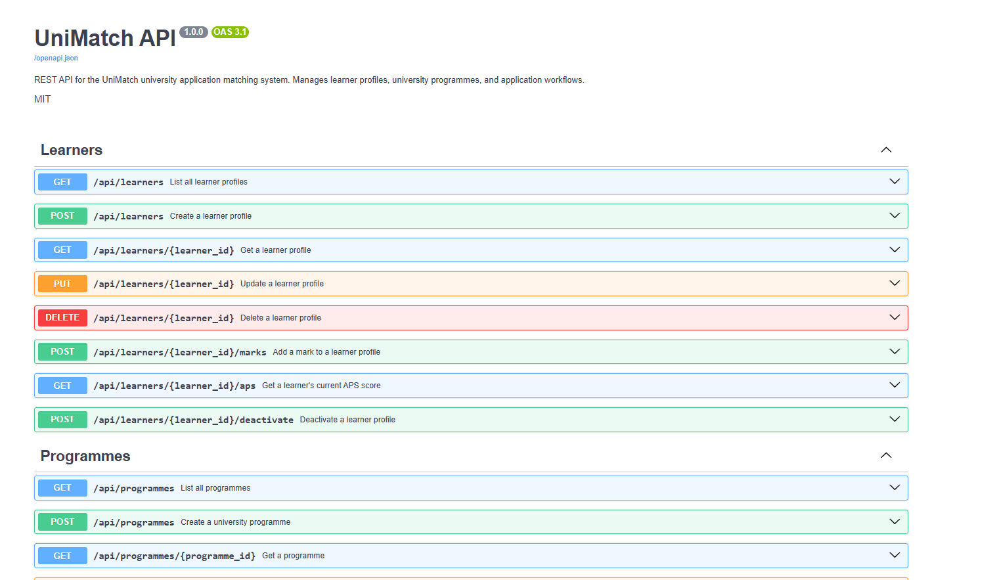

# API documentation

- **`openapi.yaml`** — OpenAPI 3.0.3 specification (can be imported into Postman or compared to the live schema).
- **Swagger UI** — Run the app (`uvicorn api:app --reload` from `ASSIGNMENT_12/`) and open **http://127.0.0.1:8000/docs** for interactive docs (assignment screenshot).
- **ReDoc** — **http://127.0.0.1:8000/redoc**

## Swagger UI Screenshots



.png)

.png)

To refresh the YAML from a running server:

```bash
curl http://127.0.0.1:8000/openapi.json -o openapi.json
```

