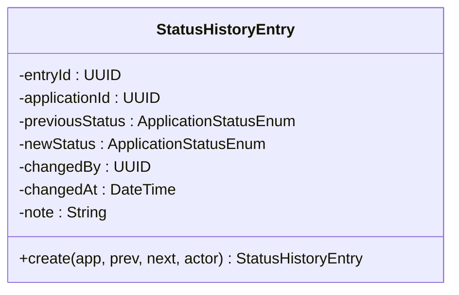

# Assignment 9: Domain Modeling and Class Diagram Development
 
**System**: UniMatch – School-Based University Application & Eligibility System  
**Author**: Christinah Mmabotse Mosima  
**Date**: 2026-04-24  
**Assignment**: 9 – Class Diagram Development  
**Builds on**: SPECIFICATION.md v2.0 · SYSTEM_REQUIREMENTS_COMPLETE.md (FR1–FR15) · USE_CASE_SPECIFICATIONS.md (UC1–UC15) · ARCHITECTURE.md v2.0 · ASSIGNMENT_8 (STD1–STD8, AD1–AD8)

## 2. Class Diagram in Mermaid.js

```mermaid
classDiagram
    %% ── ENUMERATIONS ──────────────────────────────────────────────────────────
    class RoleEnum {
        <<enumeration>>
        Teacher
        SchoolAdmin
        Learner
        Parent
        UniversityAdmissions
        DoEOfficial
        ITSupport
    }
 
    class ApplicationStatusEnum {
        <<enumeration>>
        Draft
        FeeOutstanding
        FeePaid
        PackageIncomplete
        PackageReady
        Submitted
        UnderReview
        DocsRequested
        Accepted
        Rejected
        Waitlisted
        Cancelled
        DeadlineMissed
    }
 
    class EligibilityEnum {
        <<enumeration>>
        Guaranteed
        Likely
        Borderline
        NotEligible
    }
 
    class ProgrammeStatusEnum {
        <<enumeration>>
        Draft
        Published
        UnderEdit
        Expired
        Deactivated
        Archived
    }
 
    class PaymentStatusEnum {
        <<enumeration>>
        Initiated
        AwaitingGateway
        Confirmed
        Declined
        TimedOut
        Bypassed
    }
 
    %% ── CORE ENTITIES ─────────────────────────────────────────────────────────
    class UserAccount {
        -userId : UUID
        -email : String
        -passwordHash : String
        -role : RoleEnum
        -failedAttempts : Integer
        -lockedUntil : DateTime
        -mfaSecret : String
        -isActive : Boolean
        -createdAt : DateTime
        -updatedAt : DateTime
        +login(email, password) JWT
        +verifyMFA(otp) Boolean
        +resetPassword(newPassword) void
        +isLocked() Boolean
        +hasRole(role) Boolean
        +logout() void
    }
 
    class LearnerProfile {
        -learnerId : UUID
        -fullName : String
        -schoolIdNumber : String
        -grade : Integer
        -status : ProfileStatusEnum
        -counselorId : UUID
        -schoolId : UUID
        -createdAt : DateTime
        -updatedAt : DateTime
        +isComplete() Boolean
        +getApsScore() Integer
        +getSubjectMarks() Mark[]
        +generateRecommendations() RecommendationResult[]
        +getActiveApplications() Application[]
        +deactivate() void
    }
 
    class Mark {
        -markId : UUID
        -learnerId : UUID
        -subjectName : String
        -score : Integer
        -examType : String
        -academicYear : Integer
        -createdAt : DateTime
        +isValid() Boolean
        +toApsPoints() Integer
        +getLevel() Integer
    }
 
    class UniversityProgramme {
        -programmeId : UUID
        -universityId : UUID
        -name : String
        -faculty : String
        -minimumAps : Integer
        -applicationDeadline : Date
        -applicationFee : Decimal
        -requiredDocuments : String[]
        -status : ProgrammeStatusEnum
        -publishedBy : UUID
        -version : Integer
        -createdAt : DateTime
        -updatedAt : DateTime
        +isActive() Boolean
        +isExpired() Boolean
        +publish() void
        +deactivate() void
        +meetsRequirements(profile) Boolean
        +extendDeadline(newDate) void
    }
 
    class Application {
        -applicationId : UUID
        -learnerId : UUID
        -programmeId : UUID
        -status : ApplicationStatusEnum
        -paymentReference : String
        -feeAmount : Decimal
        -submissionTimestamp : DateTime
        -acknowledgementReference : String
        -createdAt : DateTime
        -updatedAt : DateTime
        +canSubmit() Boolean
        +submit() void
        +updateStatus(status, actorId) void
        +isDeadlinePassed() Boolean
        +getStatusHistory() StatusHistoryEntry[]
        +getDocuments() Document[]
        +cancel() void
    }
 
    class Document {
        -documentId : UUID
        -learnerId : UUID
        -applicationId : UUID
        -documentType : String
        -filename : String
        -storagePath : String
        -mimeType : String
        -sizeBytes : Integer
        -uploadedBy : UUID
        -virusScanStatus : String
        -status : String
        -uploadedAt : DateTime
        +isValid() Boolean
        +scan() String
        +linkToApplication(applicationId) void
        +delete() void
    }
 
    class RecommendationResult {
        -resultId : UUID
        -learnerId : UUID
        -programmeId : UUID
        -eligibilityCategory : EligibilityEnum
        -learnerAps : Integer
        -programmeMinimumAps : Integer
        -isStale : Boolean
        -generatedAt : DateTime
        +classify() EligibilityEnum
        +getExplanation() String
        +markStale() void
        +isCurrentFor(profile) Boolean
    }
 
    class PaymentTransaction {
        -transactionId : UUID
        -applicationId : UUID
        -status : PaymentStatusEnum
        -paymentReference : String
        -amount : Decimal
        -initiatedAt : DateTime
        -resolvedAt : DateTime
        +initiate() void
        +confirm(reference) void
        +decline(reason) void
        +timeout() void
    }
 
    class Notification {
        -notificationId : UUID
        -recipientId : UUID
        -type : String
        -status : String
        -message : String
        -retryCount : Integer
        -createdAt : DateTime
        -sentAt : DateTime
        +dispatch() void
        +retry() void
        +markRead() void
        +markFailed() void
    }
 
    class AuditLogEntry {
        -entryId : UUID
        -actorId : UUID
        -action : String
        -targetType : String
        -targetId : UUID
        -oldValue : JSON
        -newValue : JSON
        -timestamp : DateTime
        +create(actor, action, target) AuditLogEntry
    }
 
    %% ── SERVICE LAYER ─────────────────────────────────────────────────────────
    class RecommendationService {
        <<service>>
        +generateRecommendations(learnerId) RecommendationResult[]
        -fetchMarks(learnerId) Mark[]
        -fetchProgrammes() UniversityProgramme[]
    }
 
    class ApsCalculator {
        <<service>>
        +calculate(marks) Integer
        -applyNscScale(score) Integer
        -selectTopN(marks, n) Mark[]
    }
 
    class RequirementMatcher {
        <<service>>
        +match(aps, marks, programme) Boolean
        -checkSubjectRequirements(marks, required) Boolean
    }
 
    class EligibilityClassifier {
        <<service>>
        +classify(learnerAps, minimumAps, subjectsMet) EligibilityEnum
    }
 
    class NotificationService {
        <<service>>
        +checkDeadlines() void
        +dispatch(notification) void
        +retry(notificationId) void
        -buildMessage(type, context) String
    }
 
    class ReportingService {
        <<service>>
        +generateReport(filters, role) Report
        +anonymise(data) AnonData
        +exportToCsv(report) File
        +exportToPdf(report) File
    }
 
    %% ── RELATIONSHIPS ─────────────────────────────────────────────────────────
 
    %% UserAccount associations
    UserAccount "1" --> "0..*" AuditLogEntry : generates
    UserAccount "1" --> "0..*" Notification : receives
 
    %% LearnerProfile composition and associations
    LearnerProfile "1" *-- "0..*" Mark : composed of
    LearnerProfile "1" o-- "0..*" Application : has
    LearnerProfile "1" o-- "0..*" Document : has
    LearnerProfile "1" o-- "0..*" RecommendationResult : has
    LearnerProfile "0..*" --> "1" UserAccount : assignedCounselor
 
    %% Application associations
    Application "0..*" --> "1" UniversityProgramme : appliesTo
    Application "1" *-- "1..5" StatusHistoryEntry : records
    Application "1" *-- "0..1" PaymentTransaction : paidVia
    Application "1" o-- "0..*" Document : contains
 
    %% RecommendationResult associations
    RecommendationResult "0..*" --> "1" UniversityProgramme : evaluates
 
    %% Service dependencies
    RecommendationService --> ApsCalculator : uses
    RecommendationService --> RequirementMatcher : uses
    RecommendationService --> EligibilityClassifier : uses
    RecommendationService ..> LearnerProfile : reads
    RecommendationService ..> UniversityProgramme : reads
    RecommendationService ..> RecommendationResult : creates
 
    NotificationService ..> Notification : creates
    NotificationService ..> Application : monitors
    NotificationService ..> UniversityProgramme : checksDeadlines
 
    ReportingService ..> LearnerProfile : aggregates
    ReportingService ..> Application : aggregates
 
    %% Enum usage (noted)
    UserAccount --> RoleEnum : role
    Application --> ApplicationStatusEnum : status
    RecommendationResult --> EligibilityEnum : eligibilityCategory
    UniversityProgramme --> ProgrammeStatusEnum : status
    PaymentTransaction --> PaymentStatusEnum : status
```
 

 
---
 
### StatusHistoryEntry (supporting class referenced above)
 

 
---
 
## 3. Key Design Decisions
 
### Decision 1: Composition vs Aggregation for Application–Document
 
`Application` and `Document` use **aggregation** (`o--`), not composition (`*--`). A document can exist in a `Stored` or `Unlinked` state independently of any application — a teacher may upload a document before deciding which application to link it to. If the application is deleted, documents are retained for audit purposes. This matches the Document lifecycle in STD5 (Assignment 8).
 
`Application` and `StatusHistoryEntry` use **composition** (`*--`) because status history entries are meaningless without their parent application — they cannot exist independently and are deleted when the application is deleted.
 
### Decision 2: LearnerProfile is not a subclass of UserAccount
 
This was a deliberate trade-off. Learners interact with the system through a `LearnerAccount` (subtype of UserAccount) for their own portal view, but the `LearnerProfile` is created and managed by teachers. The profile holds academic data (marks, recommendations, applications) while the account holds authentication data. Combining them into one class would violate the Single Responsibility Principle — academic data management and authentication are distinct concerns. The relationship is modelled as `LearnerProfile --> UserAccount (counselor)` for the assigned teacher.
 
### Decision 3: Services as a separate layer
 
`RecommendationService`, `NotificationService`, and `ReportingService` are modelled as separate service classes rather than methods on the domain entities. This matches the ARCHITECTURE.md §4 component model (Recommendation Engine Service, Notification Service, Reporting Service) and reflects the real implementation: these services orchestrate across multiple entities and cannot be owned by a single entity. `ApsCalculator`, `RequirementMatcher`, and `EligibilityClassifier` are sub-services of `RecommendationService`, directly implementing the C4 Level 4 code diagram from ARCHITECTURE.md §5.
 
### Decision 4: PaymentTransaction stores no card data
 
The `PaymentTransaction` class has no card number, CVV, or bank account fields — only `paymentReference` (the token returned by the external gateway). This is not an oversight; it is the implementation of TC-NFR03 and US029 at the class level. The design enforces the payment security requirement structurally — it is impossible to store card data because the fields do not exist.
 
### Decision 5: AuditLogEntry is immutable
 
`AuditLogEntry` has a single static factory method `create()` and no setter methods. This reflects FR15 — audit entries must be tamper-proof records of what happened. No `update()` or `delete()` method is defined because audit entries are never modified after creation.
 
---