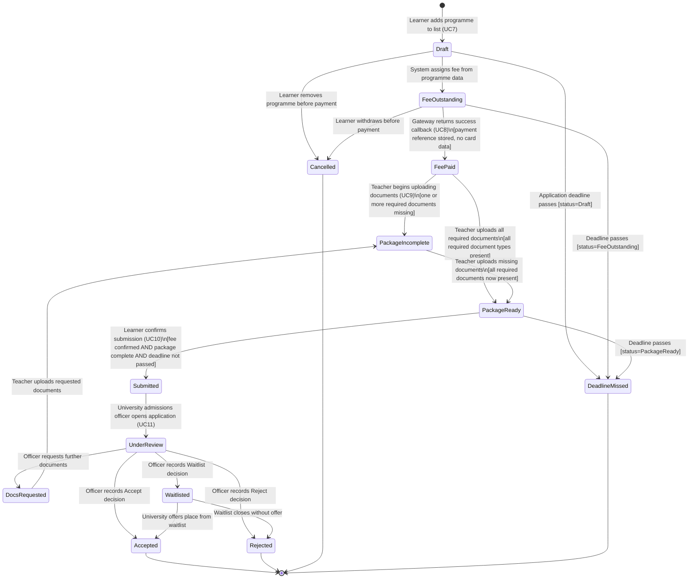
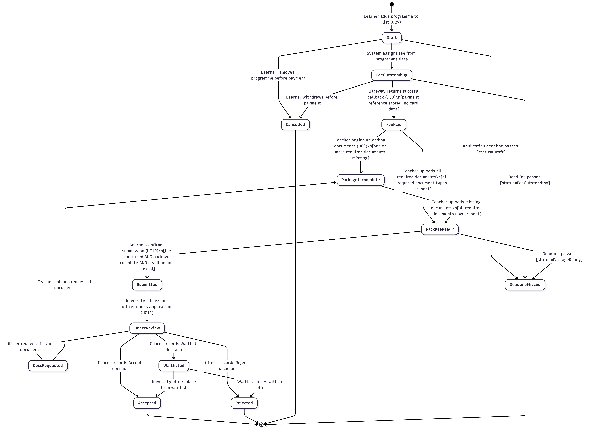
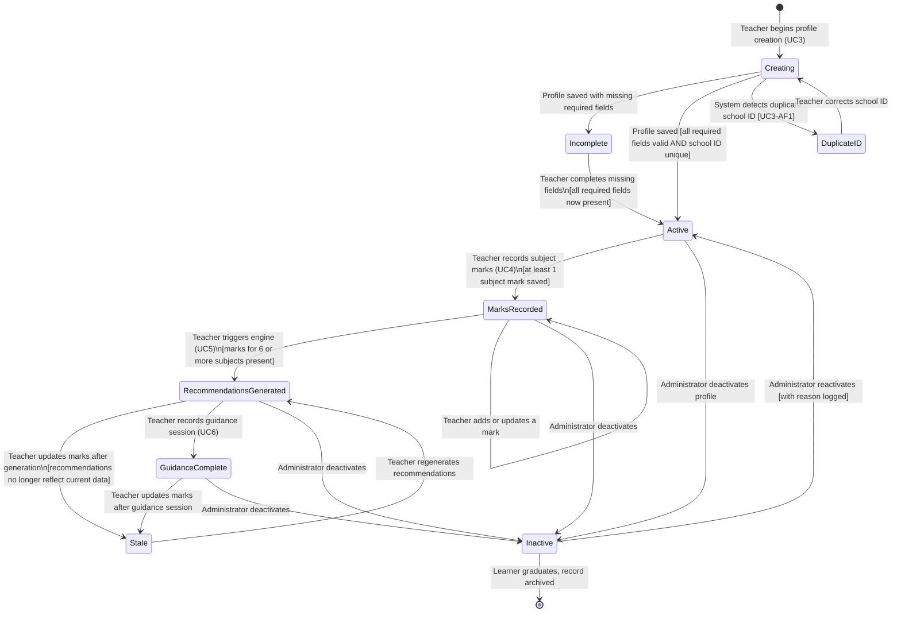
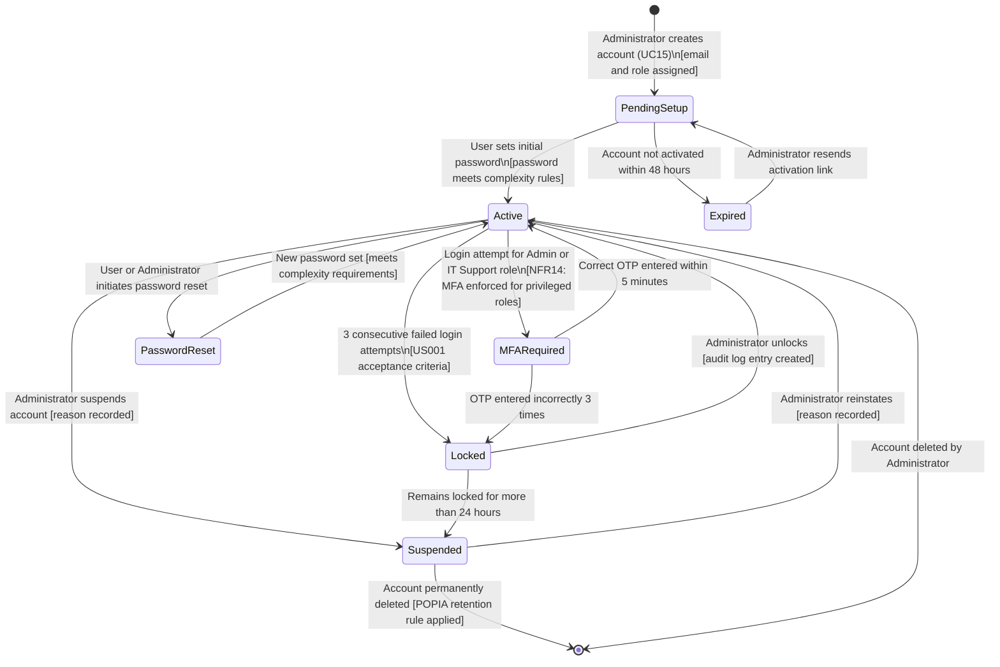
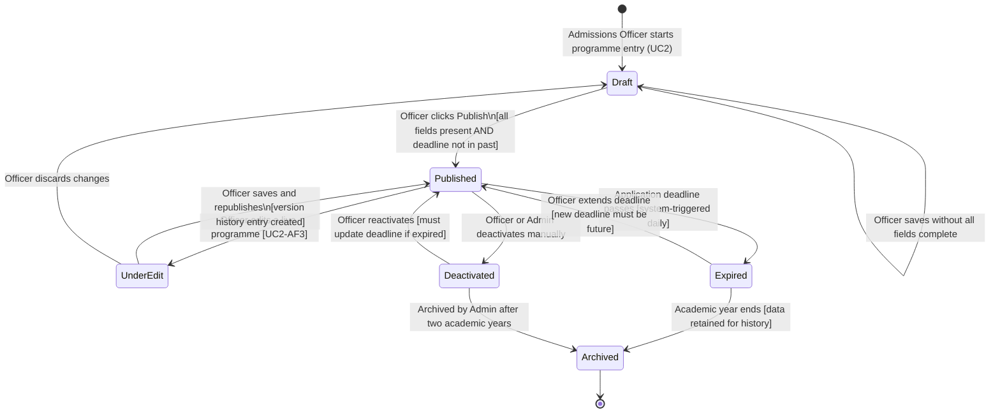
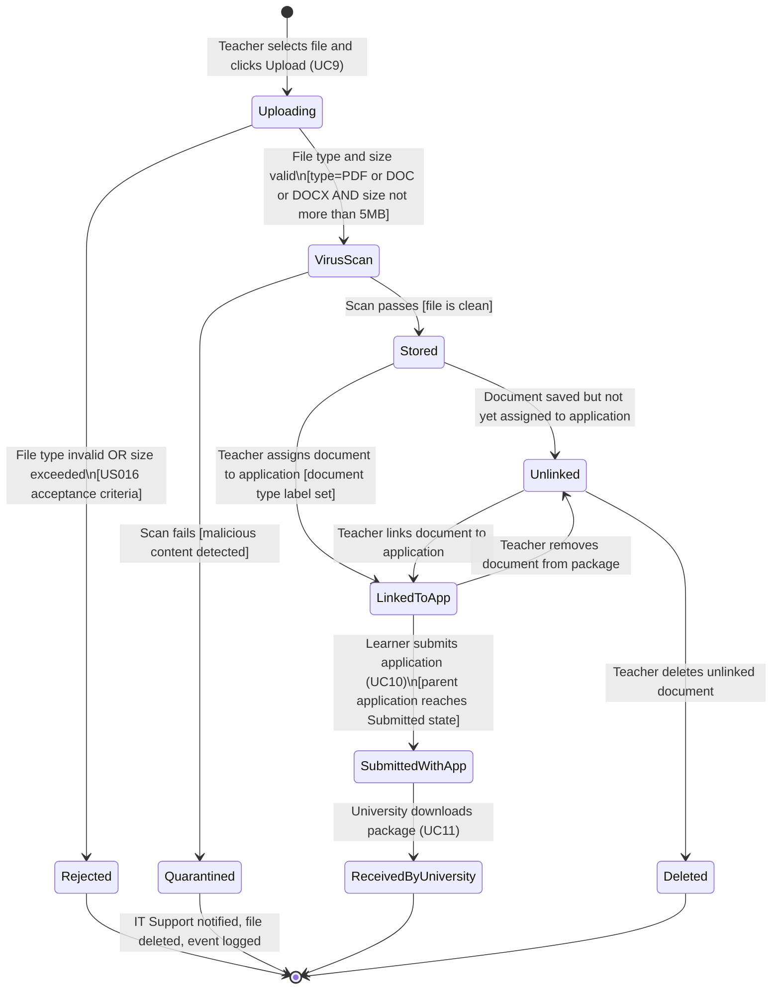
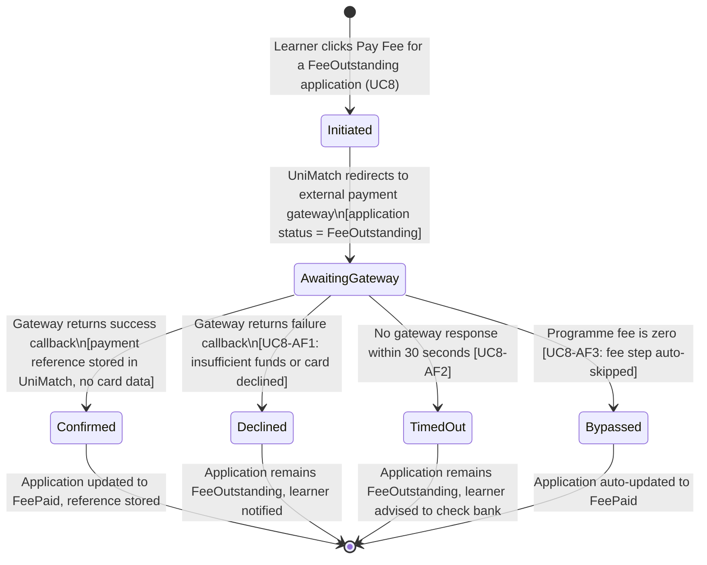
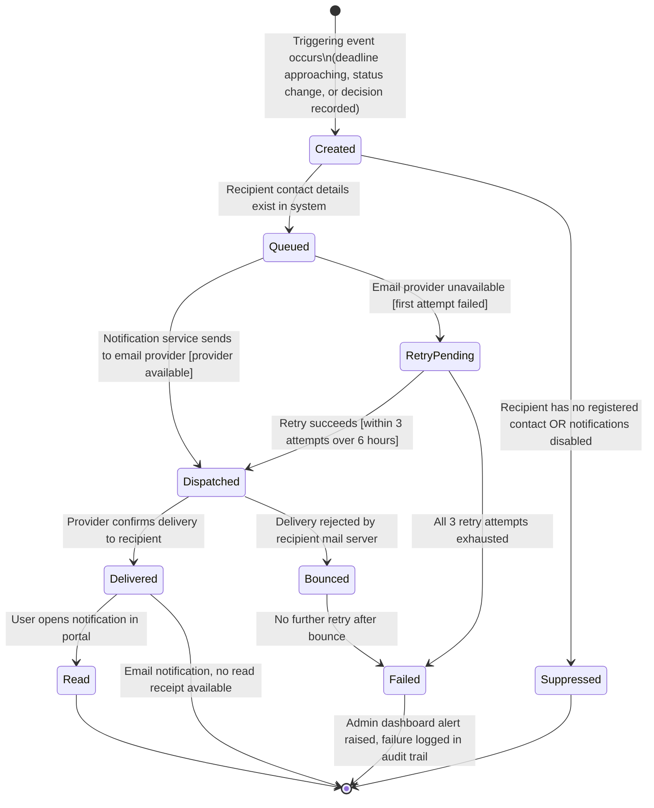
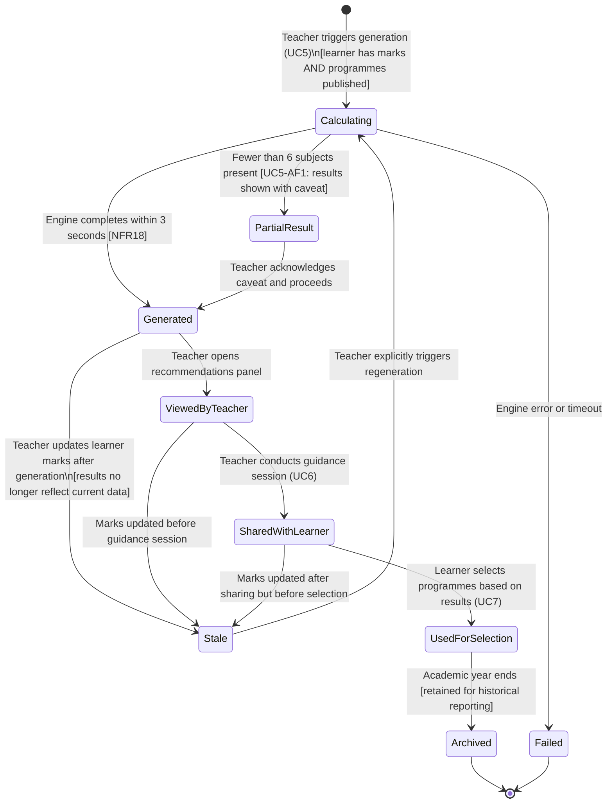

# Assignment 8: Object State Modeling — State Transition Diagrams
# UniMatch – School-Based University Application & Eligibility System

**Author**: Christinah Mmabotse Mosima
**Date**: 2026-04-15
**Assignment**: 8 – Object State Modeling and Activity Workflow Modeling
**Builds on**: Assignment 4 (FR1–FR15), Assignment 5 (UC1–UC15), Assignment 6 (US001–US030)

---

## Overview

This document defines state transition diagrams for 8 critical objects in UniMatch. Each diagram models the complete lifecycle of an object — every state it can occupy, every event that triggers a transition, and every guard condition that constrains movement between states. All diagrams are grounded in the functional requirements from Assignment 4 and the use case specifications from Assignment 5.

---

---
 
## 1. State Transition Diagrams
 
---
 
### STD1 — University Application
 
The Application object is the central lifecycle entity in UniMatch. It tracks a single learner's application to one university programme from first selection through to a final admission decision.
 

 
**Key states**: Draft, FeeOutstanding, FeePaid, PackageIncomplete, PackageReady, Submitted, UnderReview, DocsRequested, Accepted, Rejected, Waitlisted, Cancelled, DeadlineMissed (terminal).
 
**Critical transition**: `PackageReady → Submitted` is guarded by three simultaneous conditions — fee confirmed, package complete, deadline not passed — implementing the UC10 «includes» UC8 and UC10 «includes» UC9 use case relationships.
 
**Guard conditions**: `DeadlineMissed` can be entered from Draft, FeeOutstanding, or PackageReady — the deadline check runs daily against all non-submitted applications. `DocsRequested → PackageIncomplete` allows the workflow to resume after an additional documents request without restarting from scratch.
 
**Requirement mapping**: FR5 (status updates with audit trail), FR6 (document upload gates PackageReady), UC8, UC9, UC10, UC11, US012–US019.
 
---
 
### STD2 — Learner Profile
 
The Learner Profile holds the academic record that drives eligibility calculations and forms the basis of application packages.
 

 
**Key states**: Creating, Incomplete, DuplicateID, Active, MarksRecorded, RecommendationsGenerated, Stale, GuidanceComplete, Inactive.
 
**Critical design**: The `Stale` state prevents guidance sessions from being based on outdated eligibility data — if marks are updated after recommendations are generated, the Stale state forces regeneration before the teacher can share results with the learner.
 
**Requirement mapping**: FR1 (create/manage profiles), FR2 (CSV import triggers MarksRecorded), FR3 (recommendations from MarksRecorded), UC3, UC4, UC5, UC6, US004–US009, US011.
 
---
 
### STD3 — User Account
 
The User Account controls access for all seven actor types. Its lifecycle governs authentication, MFA, and security events.
 

 
**Key states**: PendingSetup, Active, MFARequired, Locked, PasswordReset, Suspended, Expired.
 
**Critical design**: The `Active → MFARequired` transition applies only to Admin and IT Support roles (NFR14). Teachers and learners proceed directly to token issuance. `Locked → Suspended` prevents indefinitely locked accounts from cluttering the active user list.
 
**Requirement mapping**: FR10 (RBAC), FR15 (audit log on every transition), NFR14 (MFA), UC1, UC15, US001, US002, US003.
 
---
 
### STD4 — University Programme
 
The Programme object is published by University Admissions and consumed by the recommendation engine and learner programme browser.
 

 
**Key states**: Draft, Published, UnderEdit, Expired, Deactivated, Archived.
 
**Critical design**: `Published → Expired` is system-triggered (runs daily) — this prevents learners from adding expired programmes to their application list (UC7-AF1). `UnderEdit` retains the published version in version history so learners who already selected the programme see consistent data during edits.
 
**Requirement mapping**: UC2 (publish programme), UC5 (engine reads Published programmes only), UC7 (learner browser shows only Published, disables Expired), US007.
 
---
 
### STD5 — Document (Supporting Document / Recommendation Letter)
 
Documents are uploaded by teachers to build application packages. Every document passes through virus scanning before storage.
 

 
**Key states**: Uploading, VirusScan, Stored, Unlinked, LinkedToApp, SubmittedWithApp, ReceivedByUniversity, Rejected, Quarantined.
 
**Critical design**: The `Quarantined` state ensures malicious files never enter the document store. The `LinkedToApp → Unlinked` back-transition allows teachers to remove and replace documents before submission. Once `SubmittedWithApp`, documents cannot be modified.
 
**Requirement mapping**: FR6 (upload, virus scan, secure storage), FR15 (quarantine events logged), NFR13 (security), UC9, UC10, US016, TC009, TC010.
 
---
 
### STD6 — Payment Transaction
 
The Payment Transaction exists for a single fee payment. Its lifecycle is brief but safety-critical — it prevents fraud and double-payments.
 

 
**Key states**: Initiated, AwaitingGateway, Confirmed, Declined, TimedOut, Bypassed.
 
**Critical design**: UniMatch stores only the payment reference returned by the gateway — never card details. The `TimedOut` state requires a different system response from `Declined` (UC8-AF2 vs UC8-AF1): a timeout advisory warns the learner not to retry immediately in case the bank already processed the payment.
 
**Requirement mapping**: NFR13 (no card storage), UC8, US014, US015, US029, TC-NFR03.
 
---
 
### STD7 — Notification
 
Notifications are created by system events and delivered through the external email provider with retry logic.
 

 
**Key states**: Created, Queued, Suppressed, Dispatched, RetryPending, Delivered, Bounced, Read, Failed.
 
**Critical design**: The `RetryPending` state implements the 3-attempt retry mechanism (US021 acceptance criteria). `Failed` triggers an admin dashboard alert — no deadline can pass silently due to a delivery failure. `Suppressed` is distinct from `Failed`: suppression is intentional, failure is a system error.
 
**Requirement mapping**: FR8 (deadline reminders), FR13 (escalating reminders), UC13, US020, US021, US022, US023.
 
---
 
### STD8 — Recommendation Result
 
The Recommendation Result captures the AI eligibility engine's output for a specific learner at a point in time.
 

 
**Key states**: Calculating, Generated, PartialResult, Stale, ViewedByTeacher, SharedWithLearner, UsedForSelection, Archived, Failed.
 
**Critical design**: The `Stale` state at three points (after generation, after sharing, and after use) ensures guidance sessions and learner selections are always based on current mark data. This is an emergent state not in the original requirements — it arose from modelling the full lifecycle.
 
**Requirement mapping**: FR3 (generate automatically), FR4 (Guaranteed/Likely/Borderline/Not Eligible categories), NFR18 (3-second response time), UC5, UC6, UC7, US008, US009, US012.
 
---