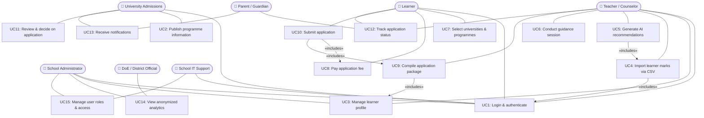

# Assignment 5 — Use Case Modeling & Specifications

## System Definition
 
UniMatch is a **centralized decision-support and application coordination platform** that connects learners, schools, universities, and the Department of Education to provide verified programme information, guided application decisions, secure fee payment, and equitable access to higher education admissions.
 
**System boundary statement**: UniMatch *orchestrates* application processes but does **not** replace existing university admission systems, payment provider infrastructure, or government databases. These remain external actors that UniMatch integrates with.
 
**Data ownership**:
- Learners own their personal and academic data
- Universities own the programme and requirements data they publish
- The DoE owns aggregated analytics outputs
- UniMatch stores data temporarily as a coordination layer — it does not claim ownership
 
 
## 1. Use Case Diagram
 
> **Screenshot of draw.io diagram goes here**
> ``
 
### Mermaid Source (for GitHub rendering)
 

 
---
 
## 2. Actor Descriptions and Roles
 
### 2.1 Actor Table
 
| Actor | Type | Role in UniMatch | Key Use Cases | Source |
|---|---|---|---|---|
| **Learner** | Primary | The central beneficiary and decision-maker. Views AI recommendations, selects universities independently, pays fees securely, submits applications, and tracks outcomes. **Final application decisions belong exclusively to the learner.** | UC1, UC7, UC8, UC10, UC12 | Updated end-to-end flow Steps 4–10 |
| **Teacher / Counselor** | Primary | Creates and manages learner academic profiles, imports marks, triggers recommendation generation, conducts structured guidance sessions, uploads recommendation letters, and compiles application packages. Acts as advisor — never as decision-maker. | UC1, UC3, UC4, UC5, UC6, UC9, UC12 | SPEC §5; SRS FR1–FR6 |
| **Parent / Guardian** | Secondary | Monitors their child's application progress and receives notifications about key milestones (submissions, decisions, deadlines). Does not initiate applications or make selection decisions. | UC12, UC13 | SRS FR8, FR12; Stakeholder Analysis |
| **School Administrator** | Primary | Oversees all learners school-wide, manages system configuration and user accounts, accesses school-level analytics, and generates compliance reports. | UC1, UC3, UC14, UC15 | SPEC §5; SRS FR9, FR10 |
| **University Admissions** | Primary | Publishes and maintains verified programme data (requirements, fees, deadlines, documents). Reviews submitted application packages and records official admission decisions within UniMatch. | UC1, UC2, UC11, UC13 | Updated flow Steps 1 & 9 |
| **DoE / District Official** | Secondary | Accesses anonymized, aggregated analytics about application trends, acceptance rates, regional outcomes, and equity indicators. Cannot view individual learner data. | UC14 | SPEC §5; SRS FR11, NFR15 |
| **School IT Support** | Supporting | Manages platform deployment, configures user accounts and access control, monitors system health. Technical administrator role — not a data-entry user. | UC1, UC15 | Stakeholder Analysis; SRS NFR4–NFR9 |
 
### 2.2 Decision Authority Matrix
 
A critical design principle of UniMatch is that the system supports decisions — it never makes them on behalf of people.
 
| Decision | Owner | System Role |
|---|---|---|
| Programme recommendation | System (AI) | Advisory only — generates ranked suggestions |
| Guidance on programme suitability | Teacher / Counselor | Advisor — documents session, does not override learner |
| Final university selection | **Learner** | Learner retains full authority at all times |
| Admission decision | **University** | UniMatch records the outcome, does not influence it |
| Analytics policy response | **DoE** | UniMatch provides data — DoE decides policy |
 
### 2.3 Stakeholder Benefit Alignment
 
Every stakeholder must derive a tangible benefit for the system to be ethically and practically justified.
 
| Stakeholder | Benefit from UniMatch |
|---|---|
| Learner | Informed programme choices; fraud-free fee payments; one-platform tracking |
| Teacher / Counselor | Structured, data-driven guidance workflow; reduced manual administration |
| Parent / Guardian | Visibility into application progress; fraud prevention through secure payments |
| School Administrator | Centralised compliance reporting; reduced administrative burden |
| University Admissions | Complete, verified application packages; reduced processing delays |
| DoE / District Official | Real-time national placement analytics; evidence base for policy decisions |
| School IT Support | Containerised deployment; modular, maintainable architecture |
 
### 2.4 External Systems (Outside the System Boundary)
 
These are **not actors** — they are external systems that UniMatch integrates with. UniMatch never replaces them.
 
| External System | Role |
|---|---|
| Payment Gateway | Processes application fee payments. UniMatch does not store card details. |
| Email / SMS Service | Delivers notifications. UniMatch triggers them; delivery infrastructure is external. |
| University Admission Systems | Record final enrolment. UniMatch submits applications; decisions are fed back. |
| Government Identity / EMIS | Optional future integration for learner identity verification. |
 
---
 
## 3. Diagram Relationship Explanation
 
### 3.1 «includes» Relationships
 
| Relationship | Explanation | Stakeholder concern addressed |
|---|---|---|
| UC4 «includes» UC1 | Importing marks requires authenticated access. Only verified staff may upload academic data. | POPIA compliance; IT Support concern for security |
| UC5 «includes» UC4 | AI recommendations require marks to exist. No marks = no APS score = no eligibility comparison. | Teachers: *"time-consuming eligibility calculations"* automated |
| UC9 «includes» UC3 | Compiling an application package requires a complete, validated learner profile (personal info, transcript, documents). | University Admissions: *"accurate supporting documentation"* |
| UC10 «includes» UC8 | Applications cannot be submitted before fee payment is confirmed. Prevents fraudulent or incomplete submissions. | Learners & Parents: fraud prevention; removes third-party agents |
| UC10 «includes» UC9 | Applications cannot be submitted without a compiled package. Ensures universities receive complete applications. | University Admissions: *"reduced incomplete applications by 40%"* |
 
### 3.2 Addressing Stakeholder Concerns from Assignment 4
 
- The **Learner** initiates **UC7: Select universities** after reviewing AI recommendations. This addresses the learner stakeholder's pain point of *"unclear eligibility"* — they now see predicted eligibility before committing to a choice.
- The **Teacher** initiates **UC5: Generate AI recommendations** (which «includes» UC4). This replaces the manual, spreadsheet-based process identified as a pain point: *"time-consuming eligibility calculations."*
- The **University Admissions** actor initiates **UC2: Publish programme information**, ensuring that all programme data in UniMatch is authoritative and up-to-date — directly addressing their concern about *"incomplete or incorrect applications."*
- The **Parent / Guardian** receives notifications via UC13 without needing to log in with full system access — addressing their concern for *"transparency in the application process"* while keeping the system simple.
- The **DoE** accesses UC14 with all PII suppressed, satisfying both their need for *"reliable aggregated statistics"* and POPIA compliance (NFR15).
 
---
 
## 4. Application Lifecycle States
 
A key design element missing from earlier versions. Every application in UniMatch moves through defined states. Lecturers specifically look for lifecycle modelling.
 
```
Draft
  ↓  (learner selects programme)
Fee Outstanding
  ↓  (learner pays fee — UC8)
Fee Paid
  ↓  (teacher compiles package — UC9)
Package Ready
  ↓  (learner confirms and submits — UC10)
Submitted
  ↓  (university receives — UC11)
Under Review
  ↓
  ├──→ Additional Documents Requested
  │         ↓  (teacher uploads, resubmits)
  │     Under Review (resumed)
  │
  ├──→ Accepted
  ├──→ Rejected
  └──→ Waitlisted
              ↓
           (university updates later)
        Accepted / Rejected (from waitlist)
```
 
**State transition rules enforced by the system:**
- A learner cannot submit an application in "Fee Outstanding" state (UC10 «includes» UC8)
- A learner cannot submit without a compiled package (UC10 «includes» UC9)
- A university cannot move an application backwards past "Submitted" — only forward
- If the application deadline passes while in "Draft" or "Fee Outstanding," status becomes "Deadline Missed" (terminal state)
 
---
 
## 5. Use Case Specifications
 
Eight critical use cases are specified in full, selected to cover the complete lifecycle, all primary actors, and the most complex flows.
 
---
 
### UC2: Publish Programme Information
 
| Field | Detail |
|---|---|
| **Use Case ID** | UC2 |
| **Use Case Name** | Publish programme information |
| **Actor(s)** | University Admissions |
| **Description** | University Admissions Officers create and maintain official programme records inside UniMatch. This data is the authoritative source used by the AI recommendation engine and displayed to learners during programme selection. It is the entry point of the entire application lifecycle. |
| **Preconditions** | University Admissions Officer is authenticated (UC1) with the University role. The university's institutional record exists (created by a System Administrator). |
| **Postconditions** | Programme record is published and immediately available to the recommendation engine (UC5) and learner programme browser (UC7). Version history entry created for audit. |
 
**Basic Flow**
 
1. Admissions Officer navigates to "My Programmes."
2. Officer selects "Add new programme" or selects an existing programme to update.
3. Officer enters or updates: programme name, faculty, minimum APS score, required subjects and minimum levels, application deadline, application fee (may be zero), and required supporting documents.
4. System validates all mandatory fields.
5. Officer clicks "Publish."
6. System saves the programme, marks it active, and makes it available to the recommendation engine and programme browser immediately.
7. Version history entry created with timestamp and officer ID.
 
**Alternative Flows**
 
- **AF1 – Missing mandatory fields**: System highlights empty required fields in red. Publish blocked until resolved.
- **AF2 – Application deadline in the past**: System warns the officer and asks for confirmation before allowing save. Prevents accidental publication of expired programmes.
- **AF3 – Updating a live programme**: System saves the update, logs version history (old values retained), and applies the new values to the recommendation engine immediately. Learners who already selected this programme are notified of the change.
 
---
 
### UC3: Manage Learner Profile
 
| Field | Detail |
|---|---|
| **Use Case ID** | UC3 |
| **Use Case Name** | Manage learner profile |
| **Actor(s)** | Teacher / Counselor, School Administrator |
| **Description** | Teachers create, view, and update learner academic profiles including personal details, subject choices, marks, and assigned counselor. Profiles are the data foundation for AI recommendations and application packages. |
| **Preconditions** | User is authenticated (UC1). |
| **Postconditions** | Learner profile is created or updated. Audit log entry recorded with timestamp and acting user (FR15). |
 
**Basic Flow**
 
1. Teacher navigates to "Learners" → "Add new learner" or clicks an existing learner's name.
2. Teacher enters or updates: full name, school ID number, grade, subject choices, marks, and assigned counselor.
3. System validates required fields (name, school ID, and grade are mandatory).
4. System saves the record and confirms success.
5. Audit log entry created.
 
**Alternative Flows**
 
- **AF1 – Duplicate school ID**: System flags the duplicate and blocks saving until the teacher verifies or corrects the entry.
- **AF2 – Missing required fields**: Fields highlighted in red. Save blocked.
- **AF3 – Bulk operations**: Teacher selects multiple learners and applies a common update (e.g., grade promotion, counselor reassignment) via bulk edit (FR14).
 
---
 
### UC5: Generate AI Recommendations
 
| Field | Detail |
|---|---|
| **Use Case ID** | UC5 |
| **Use Case Name** | Generate AI recommendations |
| **Actor(s)** | Teacher / Counselor |
| **Description** | UniMatch analyses a learner's academic performance against all published university programme requirements and generates a personalised ranked list of programme recommendations. Results are advisory only — they inform but do not determine the learner's choices. The system displays the factors that influenced each recommendation to prevent black-box AI concerns. |
| **Preconditions** | Teacher is authenticated. Learner profile has marks for at least 6 subjects (UC4 complete). University programme data is published (UC2 complete). |
| **Postconditions** | Ranked recommendation list displayed and stored against the learner's profile. Each programme shows: eligibility category, contributing factors (APS score, subject performance, required subject match), and alternatives. Results available for the guidance session (UC6). |
 
**Basic Flow**
 
1. Teacher opens a learner's profile.
2. Teacher clicks "Generate recommendations."
3. System retrieves the learner's mark records from the database.
4. AI recommendation engine calculates the learner's APS score and eligibility against all active published programmes.
5. System compares APS, required subjects, and subject levels against each programme's minimum requirements.
6. Each programme is classified: Guaranteed / Likely / Borderline / Not Eligible.
7. For each programme, the system generates a brief explanation: which factors contributed positively and which fell below requirements (e.g., "Mathematics level meets requirement. Physical Science below minimum.").
8. Ranked list is displayed on the learner's profile within 3 seconds (NFR18).
9. Teacher can filter by university, faculty, or eligibility category.
 
**Alternative Flows**
 
- **AF1 – Fewer than 6 subjects**: Warning banner: "APS may be inaccurate — fewer than 6 subjects are recorded." Results shown with caveat. Teacher encouraged to complete the profile before sharing results with the learner.
- **AF2 – No programmes published**: System displays: "No university programmes are currently available. Universities must publish programme data before recommendations can be generated."
- **AF3 – Stale programme data**: Programmes not updated in over 12 months are flagged with a warning icon and the date last updated.
 
---
 
### UC6: Conduct Guidance Session
 
| Field | Detail |
|---|---|
| **Use Case ID** | UC6 |
| **Use Case Name** | Conduct guidance session |
| **Actor(s)** | Teacher / Counselor |
| **Description** | The teacher facilitates a structured guidance session with the learner to review AI recommendations, discuss programme suitability, explain risks, and clarify requirements. The learner retains full authority over all final application decisions. The teacher documents the session for school records. |
| **Preconditions** | Teacher is authenticated. AI recommendations have been generated for the learner (UC5 complete). |
| **Postconditions** | Guidance session notes are saved against the learner's profile with the counselor's ID and timestamp. Learner is considered informed and may proceed to select universities independently (UC7). |
 
**Basic Flow**
 
1. Teacher opens the learner's recommendation results on-screen.
2. Teacher reviews the ranked programme list with the learner, explaining each eligibility category.
3. Teacher discusses: programme suitability, admission risks, alternative options, and the learner's own academic strengths and gaps.
4. Teacher records structured session notes: topics discussed, risks flagged, alternatives suggested, learner's expressed preferences.
5. Teacher saves the guidance notes to the learner's profile.
6. System timestamps the session and records the acting counselor's ID.
7. Learner proceeds independently to UC7 (university selection) — no teacher action required for that step.
 
**Alternative Flows**
 
- **AF1 – Learner disputes a recommendation category**: Teacher can add a counselor note explaining the dispute, but cannot alter the system's calculated eligibility category. This preserves system integrity while acknowledging counselor professional judgement.
- **AF2 – No recommendations available**: Teacher can still record a guidance session note manually, stating the reason recommendations could not be generated and what alternatives were discussed.
 
---
 
### UC7: Select Universities and Programmes
 
| Field | Detail |
|---|---|
| **Use Case ID** | UC7 |
| **Use Case Name** | Select universities & programmes |
| **Actor(s)** | Learner |
| **Description** | The learner independently browses verified university programme information, reviews their eligibility predictions, compares fees and deadlines, and selects the programmes they wish to apply to. The learner retains full authority — the system provides information and warnings but does not block any eligible or borderline selection. |
| **Preconditions** | Learner is authenticated (UC1). AI recommendations have been generated (UC5 complete). At least one programme is actively published. |
| **Postconditions** | Selected programmes are added to the learner's application list with status "Draft." Ready for fee payment (UC8). |
 
**Basic Flow**
 
1. Learner navigates to "Programme Explorer."
2. System displays programmes sorted by eligibility likelihood (from UC5 results).
3. Learner can filter by university, faculty, deadline, fee range, or eligibility category.
4. Learner clicks on a programme to view full details: APS requirement, required subjects, deadline, application fee, required documents.
5. Learner clicks "Add to my applications."
6. System adds the programme to the learner's application list with status "Draft" and confirms the addition.
 
**Alternative Flows**
 
- **AF1 – Programme deadline has passed**: System displays: "This programme's application deadline has passed." The "Add" button is disabled. Programme is still visible for reference.
- **AF2 – Learner selects a Borderline or Not Eligible programme**: System displays a clear eligibility warning and asks for confirmation — but does **not block** the selection. Learner autonomy is preserved. The warning is logged.
- **AF3 – Duplicate selection**: If a programme is already in the learner's application list, system notifies the learner and does not add a duplicate entry.
 
---
 
### UC8: Pay Application Fee
 
| Field | Detail |
|---|---|
| **Use Case ID** | UC8 |
| **Use Case Name** | Pay application fee |
| **Actor(s)** | Learner |
| **Description** | Learners pay official university application fees through UniMatch's integrated, certified payment gateway. This eliminates the need for third-party agents and prevents payment fraud. UniMatch does not store card details — payment processing is fully delegated to the external gateway. Payment confirmation is required before an application can be submitted (UC10 «includes» UC8). |
| **Preconditions** | Learner is authenticated. At least one programme is in the application list with status "Draft" (UC7 complete). |
| **Postconditions** | Payment confirmed. Payment reference attached to application record. Application status updates to "Fee Paid." Application unlocked for submission. |
 
**Basic Flow**
 
1. Learner navigates to "My Applications" and selects an application with status "Draft."
2. System displays the official fee amount as published by the university (UC2).
3. Learner clicks "Pay fee." System redirects to the integrated payment gateway.
4. Learner completes payment using their chosen payment method. UniMatch does not see or store card details.
5. Payment gateway returns a confirmed payment reference to UniMatch via a secure callback.
6. System updates the application status to "Fee Paid" and records the payment reference and timestamp.
7. Learner receives a payment confirmation notification (UC13).
 
**Alternative Flows**
 
- **AF1 – Payment declined**: Gateway returns a failure response. System displays: "Payment unsuccessful. Please check your payment details and try again." Application status remains "Draft."
- **AF2 – Payment gateway timeout**: If the gateway does not respond within 30 seconds, system displays a timeout message. Learner is advised to check their bank statement before retrying to avoid double payment.
- **AF3 – Zero fee programme**: If the university has published a zero application fee, the payment step is automatically bypassed and the application moves directly to "Fee Paid" status without requiring learner action.
 
---
 
### UC10: Submit Application
 
| Field | Detail |
|---|---|
| **Use Case ID** | UC10 |
| **Use Case Name** | Submit application |
| **Actor(s)** | Learner |
| **Description** | UniMatch compiles a standardised application package and securely submits it to the selected university through the platform's integration interface. Submission is only permitted after fee payment is confirmed (UC8) and the package is compiled (UC9). If the university integration is unavailable, the system queues the application and retries automatically. |
| **Preconditions** | Learner is authenticated. Fee confirmed (UC8 «includes»). Application package compiled (UC9 «includes»). Programme deadline has not passed. |
| **Postconditions** | Application submitted to university. Status updated to "Submitted." Learner and assigned teacher receive confirmation notification (UC13). |
 
**Basic Flow**
 
1. Learner navigates to "My Applications" and opens an application with status "Package Ready."
2. Learner reviews the compiled application package: academic transcript, personal information, supporting documents, recommendation letters.
3. Learner clicks "Submit application."
4. System performs pre-submission checks: fee confirmed, all required documents present, deadline not passed.
5. System transmits the package to the university via the integration interface.
6. University system returns a submission acknowledgement reference.
7. System updates status to "Submitted," records the timestamp and reference.
8. Learner and assigned teacher receive confirmation notifications (UC13).
 
**Alternative Flows**
 
- **AF1 – Missing required documents**: System lists the absent documents and blocks submission. The assigned teacher is alerted via notification to upload the missing items (UC9). Application status remains "Package Ready — Incomplete."
- **AF2 – Deadline passed between selection and submission**: System displays: "The application deadline for this programme has passed. Your application cannot be submitted." Status updates to "Deadline Missed" (terminal state).
- **AF3 – University integration unavailable**: System queues the application, displays: "Submission is temporarily delayed due to a technical issue. Your application has been saved and will be submitted automatically. You will receive a confirmation when complete." Learner is notified when submission is successful.
 
---
 
### UC11: Review and Decide on Application
 
| Field | Detail |
|---|---|
| **Use Case ID** | UC11 |
| **Use Case Name** | Review & decide on application |
| **Actor(s)** | University Admissions |
| **Description** | University Admissions Officers review submitted application packages within UniMatch and record their official admission decision. Decisions trigger automatic real-time status updates and notifications to the learner and their school. UniMatch records the decision — the university retains full decision-making authority. |
| **Preconditions** | Admissions Officer is authenticated with the University role. At least one application with status "Submitted" or "Under Review" exists for this institution. |
| **Postconditions** | Decision recorded. Application status updated. Learner and assigned teacher notified automatically (UC13). Audit entry created with officer ID, decision, and timestamp. |
 
**Basic Flow**
 
1. Admissions Officer navigates to "Incoming Applications."
2. System lists all submitted applications for the officer's programmes.
3. Officer opens an application and reviews: academic transcript, APS score, supporting documents, recommendation letters, eligibility category from the AI engine.
4. Officer selects a decision: Accept / Reject / Waitlist / Request Additional Documents.
5. Officer optionally adds a decision note.
6. Officer confirms the decision.
7. System records the decision, updates status, and triggers notifications to the learner and their teacher (UC13).
 
**Alternative Flows**
 
- **AF1 – Request additional documents**: Officer selects this option and specifies exactly what is required. Status updates to "Additional Documents Requested." Learner and teacher notified with the specific list.
- **AF2 – Revising a preliminary decision**: A decision can be revised before a formal acceptance letter is issued. The revision is logged alongside the original decision — full audit trail preserved.
- **AF3 – System records but university decides**: The AI recommendation category is displayed for officer reference only. The system does not weight or influence the officer's decision — the university retains full decision authority.
 
---